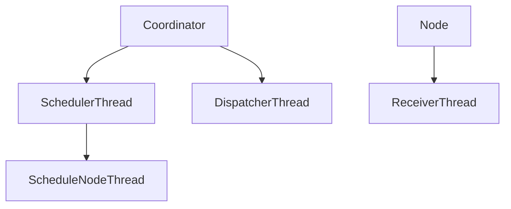
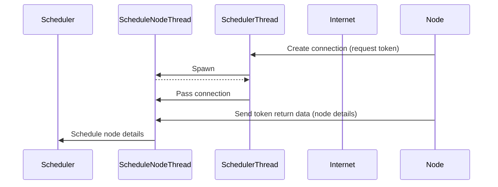

# Template Demo
You get all of your [markdown goodies](https://markdown-it.github.io/), and more! This document a non-exhaustive showcase of some of the most exciting capabilities of this template

## GitHub Theme
Everything Octocat

## Beautiful Tables
| First name | Last name | Date of birth |
| ---------- | --------- | ------------- |
| John       | Doe       | 3/12/1920     |
| Peter      | Smith     | 6/5/1967      |
| Julia      | Jones     | 5/2/1978      |
| Lucas      | Richard   | 4/4/1920      |

## Code
```javascript
function show(x, y, z) {
  var x = $(x),
    y = $(y),
    z = $(z);
  x.addClass('win');
  y.addClass('win');
  z.addClass('win');
  lockAll();
  setTimeout(reset, 1500);
}
```

## Page Break
_PDF only_

---

## Math
### Unbounded knapsack problem (UKP) 
Given a set of $n$ items numbered from 1 up to $n$, each with a weight $w_i$ and a $v_i$, along with a maximum weight capacity $W$,

Maximize: 
> $$ \sum_{i=1}^{m}v_ix_i $$

Subject to:
> $$ \sum_{i=1}^{m}v_ix_i \leq W \text{ and } x_i \ge 0 $$

## Mermaid
### Graphs


<p style="page-break-before: always"></p>

## Class diagrams


## ASCII art
```
                 @@  @@ 
                ,-@@~@-.   
 _              (_, O _/   
| Y~.            (__d._)    
| r.|    Y@oooood@@@@@@@@oooo@F 
 Y ||   _Y@@@@@@P   "V"  Y@@@@f 
 | t_\_/ _)@@@@@          @@@@f  __     ,--,
  \  `. / ~@@@@@    . .   @@@@  (_ `---'  ~~)
   `-._/)   @@@@b__|@_@|_d@@@    _l,'~   ~~)
      (,db   (   _  `-' _   )  ,d@_)---~~~~
         Yb.  \ '|\____/|` / od@P 
          Y@b  \ | nn  /','d@@P 
            Y@b `\`---'/'od@P 
             ~@@@@`---'@@@P~
               Y@@@@@@@@@~
                @@@@@@@@
```